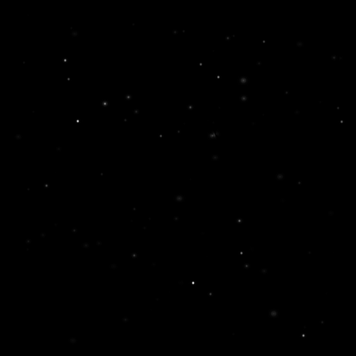
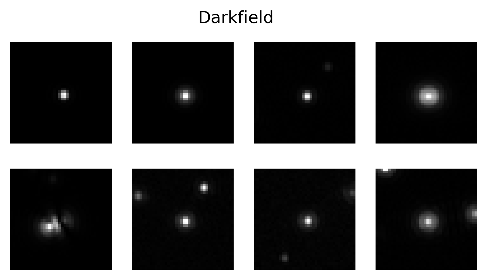

# Detection and Quantification in Darkfield

In this notebook we will investigate how to detect and quantify particles in Darkfield. 

The notebook contains the following sections:

1. Imports 
    - Importing the packages needed to run the code.
2. Detection in Darkfield
    - We leverage two different methods for particle detection: the Radial Variance Transform(RVT) and LodeSTAR.
3. Quantification of particle properties in Darkfield
    - Here we show how to simulate particles in the Darkfield regime and train a Convolutional Neural Network(CNN) for the quantification task.
    - We provide figures of how the estimated signal scales with fixed radius aswell as with fixed refractive index and corresponding theoretical curves.
    - We also give an example on how changing the illumination angle effects these curves.
4. Combining detection and quantification in Darkfield
    - Here we provide a short example on how to analyze an entire frame by performing tracking with LodeSTAR and signal quantification with a CNN.

## Simulated data in the Darkfield regime:

Down below is an example of how simulated data in the Darkfield regime looks like. The data is generated by simulating particles with different radii and refractive indices using the `deeptrack` module. The Darkfield signal is then added with noise to simulate the experimental setup. The data is saved as a `.npy` file and is loaded into the notebook for analysis.

  
  

## Applying the Notebook to Your Own Data

Below are instructions for adapting the notebook to work with your own dataset.

1. **Prepare Your Data**: 
   - Collect your data and save it as `numpy` arrays with a `.npy` extension.
   - For best results, crop the frames to dimensions that are powers of 2, as the LodeSTAR detection model requires the data to be downsampled twice.
   - The notebook is designed to handle a single frame by default; to process multiple frames, incorporate a for loop to apply detection across each frame.
   - Data normalization (centering around 0) is recommended to improve consistency, though it’s not strictly required.

2. **Training the LodeSTAR Detection Model**:
   - Begin by selecting at least one cropped region containing a single particle, ideally one that is clearly visible and distinguishable from others. This particle should be representative of those you aim to detect.
   - Suitable sizes for the Region of Interest (ROI) are 32x32, 48x48, or 64x64 pixels.
   - If detection performance is suboptimal, consider including additional particles to increase data complexity, adjusting augmentation settings, or refining the thresholding step for full-frame particle detection. As a tip, do not include to many more particles, a range between 1-5 should work well enough.
   - The default settings in the notebook provide a solid starting point but may require fine-tuning to match your specific data.

3. **Training a Convolutional Neural Network (CNN) for Signal Prediction**:
   - For training a CNN to predict particle signals, start with the neural network architecture provided in the notebook.
   - Modify the data simulation parameters to match your experimental setup. Update variables such as `wavelength`, `resolution`, `Numerical Aperture` so they match your optical system. Also set the appropriate range for `radius` and `refractive index` based on the particles in your dataset.
   - As a tip, begin with the model provided in the notebook, then retrain it to fine-tune it specifically for your dataset.