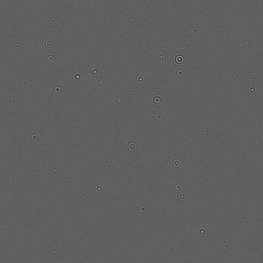
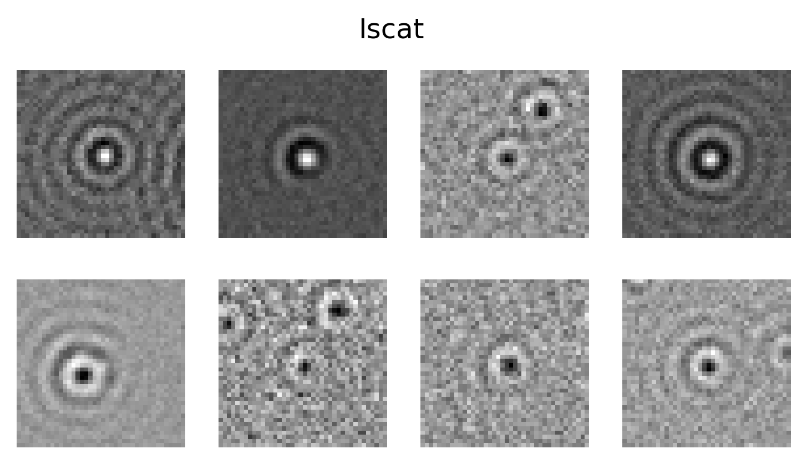

# Detection and Quantification in ISCAT

In this notebook we will investigate how to detect and quantify particles in ISCAT. 

The notebook contains the following sections:

1. Imports 
    - Importing the packages needed to run the code.
2. Detection in ISCAT
    - We leverage two different methods for particle detection: the Radial Variance Transform(RVT) and LodeSTAR.
3. Quantification of particle properties in ISCAT
    - Here we show how to simulate particles in the ISCAT regime and train a Convolutional Neural Network(CNN) for the quantification task.
    - We provide figures of how the estimated signal scales with fixed radius aswell as with fixed refractive index and corresponding theoretical curves.
4. Combining detection and quantification in ISCAT
    - Here we provide a short example on how to analyze an entire frame by performing tracking with LodeSTAR and signal quantification with a CNN.

## Simulated data in the ISCAT regime:

  
  

# How to apply to your own data: